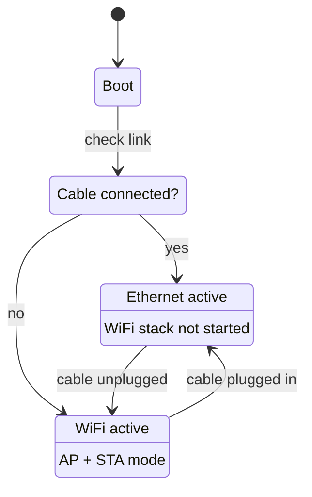

# Ethernet (W5500)

The [Esparagus Audio Brick](../boards/esparagus-audio-brick.md) supports wired Ethernet
through a **W5500 SPI module**, giving a reliable low-latency connection where WiFi is
unreliable or unavailable.

## How it works

Ethernet is checked first at boot. If a cable is connected, WiFi is skipped entirely.
Unplug the cable at runtime and WiFi starts automatically as a fallback; plug it back in
and Ethernet takes over again.



The web interface shows "Ethernet" or "WiFi" depending on which is active, and AirPlay and
Bluetooth behave identically on either.

## Wiring

The W5500 connects over SPI, sharing the bus with the OLED display.

| W5500 pin | ESP32 GPIO | Function |
| --- | --- | --- |
| CLK | 18 | SPI clock |
| MOSI | 23 | SPI data out |
| MISO | 19 | SPI data in |
| CS | 5 | Chip select |
| INT | 35 | Interrupt |
| RST | 14 | Hardware reset |
| 3V3 | 3.3 V | Power |
| GND | GND | Ground |

## Configuration

Ethernet is enabled by default in the `esparagus-audio-brick-bt` build. GPIOs can be
changed under **Board Configuration → SPI and Ethernet Configuration** in `menuconfig`.

To disable it, set:

```ini
CONFIG_ETH_W5500_ENABLED=n
```

When disabled, all Ethernet code is compiled out — no impact on flash size or RAM.

!!! note "MAC address"

    The W5500 has no factory MAC address. The firmware derives a unique one from the
    ESP32's base MAC using `ESP_MAC_ETH`, so every board gets a stable, unique Ethernet
    MAC.
